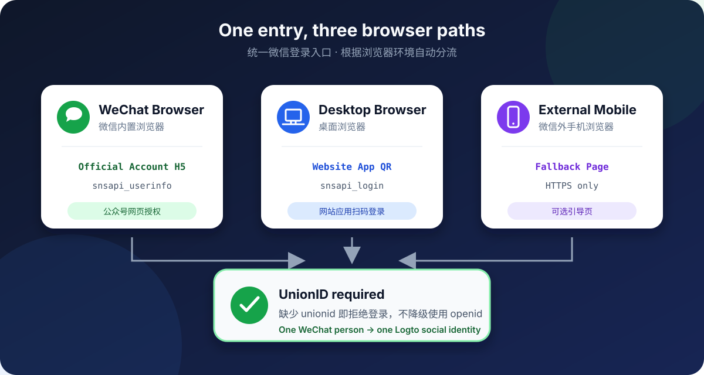
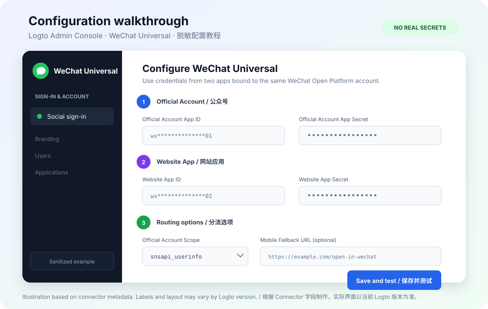

# Logto 微信 Universal Connector

<p align="center">
  <a href="https://github.com/Harry813/logto-connector-wechat-universal/actions/workflows/ci.yml"></a>
  <a href="https://github.com/Harry813/logto-connector-wechat-universal/blob/main/LICENSE"></a>
  <a href="https://github.com/Harry813/logto-connector-wechat-universal/stargazers"></a>
</p>

<p align="center">
  如果这个 Connector 帮到了你，欢迎点一个 <a href="https://github.com/Harry813/logto-connector-wechat-universal/stargazers">Star</a>，也欢迎提交 Issue 分享你的 Logto / 微信版本与使用场景。
</p>

[English](./README.md)

这是一个面向自托管 Logto 的**非官方实验性**微信社交登录 Connector。它提供一个统一的微信登录入口，根据浏览器环境在微信公众号 H5 网页授权和微信网站应用扫码授权之间分流，并且只使用 `unionid` 作为 Logto 社交身份 ID。

> [!WARNING]
> 本项目与 Logto、腾讯或微信没有隶属或官方合作关系。部署前请审查源码，并先在非生产环境完成集成验证。

## 一分钟了解



| 用户入口 | Connector 行为 | 微信能力 |
| --- | --- | --- |
| 微信内置浏览器 | 发起公众号 H5 网页授权 | `snsapi_userinfo`，或显式配置的 `snsapi_base` |
| 桌面浏览器 | 展示网站应用扫码登录 | `snsapi_login` |
| 微信外手机浏览器 | 跳转到可选的 HTTPS 引导页；未配置时使用网站应用扫码授权 | `mobileFallbackUrl` |

所有成功登录最终都必须取得 `unionid`。如果微信只返回 `openid`，Connector 会拒绝登录，避免同一个人在公众号和网站应用下被 Logto 创建成两个用户。

## 适用范围

适合：

- 自托管 Logto，并且能够安装、审查和维护第三方 Connector。
- 同时需要微信公众号内登录和桌面网站扫码登录。
- 公众号与网站应用已经绑定到同一个微信开放平台账号。

不适合：

- Logto Cloud，或无法安装自定义 Connector 的托管环境。
- 只有公众号或只有网站应用，且不需要统一入口的简单场景。
- 无法保证取得 `unionid`，但又要求自动把多个 `openid` 合并为同一用户的场景。

## 前置条件

- 支持第三方 Connector 的自托管 Logto。
- 已开通网页授权能力的认证微信公众号。
- 已审核通过的微信网站应用。
- 公众号和网站应用绑定在同一个微信开放平台账号下。
- 根据 Logto Admin Console 显示的回调地址，在微信后台完成网页授权域名和网站应用回调域名配置。

## 快速开始

### 1. 安装 Connector

把仓库克隆到 Logto 源码目录中的 `packages/connectors`：

```bash
cd <logto-root>/packages/connectors
git clone https://github.com/Harry813/logto-connector-wechat-universal.git \
  connector-wechat-universal

cd <logto-root>
npm run cli connector link
```

可以用下面的命令确认它已经出现在第三方 Connector 列表中：

```bash
npm run cli connector list
```

完成链接后重启 Logto。容器部署可以参考 [`examples/Dockerfile`](./examples/Dockerfile)，但请固定并验证具体 Logto 版本，不要直接依赖浮动的 `latest` 标签。

### 2. 在 Admin Console 中创建 Connector

重启后进入 Logto Admin Console，在社交 Connector 列表中找到 **WeChat Universal / 微信实验版**，然后填写配置。



> 上图是根据 Connector 字段制作的脱敏示意图，不是真实租户截图；字段名以你当前 Logto 版本实际显示为准。

| 配置项 | 必填 | 说明 |
| --- | --- | --- |
| `officialAccountAppId` | 是 | 微信公众号 AppID |
| `officialAccountAppSecret` | 是 | 微信公众号 AppSecret |
| `websiteAppId` | 是 | 微信网站应用 AppID |
| `websiteAppSecret` | 是 | 微信网站应用 AppSecret |
| `officialScope` | 否 | 默认 `snsapi_userinfo`；只有 token 响应含 `unionid` 时才能使用 `snsapi_base` |
| `mobileFallbackUrl` | 否 | 微信外手机浏览器打开的 HTTPS 引导页 |

不要把真实 AppID 或 AppSecret 写入镜像、构建参数、日志或代码仓库，只通过 Logto Connector 配置保存。

### 3. 加入登录体验

在 Admin Console 中进入：

```text
Sign-in & account → Sign-up and sign-in → Social sign-in
```

加入 **WeChat Universal**，保存后先使用 Logto 的 Live preview 验证登录入口，再用真实设备检查三个分流场景。

### 4. 验证登录

| 检查场景 | 预期结果 |
| --- | --- |
| 桌面浏览器 | 跳转到 `open.weixin.qq.com/connect/qrconnect` 并出现网站应用二维码 |
| 微信内置浏览器 | 跳转到 `open.weixin.qq.com/connect/oauth2/authorize` |
| 微信外手机浏览器，已配置 fallback | 跳转到 `mobileFallbackUrl`，并保留 `state` 和 `redirect_uri` 查询参数 |
| 同一微信用户分别走公众号和网站应用 | 两次响应取得同一个 `unionid`，Logto 不应产生重复社交身份 |
| 任一响应缺少 `unionid` | 登录失败，并提示检查开放平台绑定关系 |

建议只使用测试账号和非生产 Logto 实例验证。测试完成后，再检查 Logto 用户详情中的微信社交身份是否按 `unionid` 归并。

## 常见问题

<details>
<summary>Admin Console 中看不到 Connector</summary>

确认仓库位于 `<logto-root>/packages/connectors/connector-wechat-universal`，重新执行 `npm run cli connector link`，通过 `npm run cli connector list` 检查列表，然后重启 Logto。

</details>

<details>
<summary>微信提示 redirect_uri 或回调域名错误</summary>

以 Logto Admin Console 实际显示的回调地址为准，分别检查微信公众号网页授权域名和微信网站应用回调域名。不要把示例域名复制到生产配置。

</details>

<details>
<summary>登录提示缺少 unionid</summary>

检查公众号与网站应用是否绑定在同一个微信开放平台账号下，并确认这两条授权链路实际返回 `unionid`。Connector 故意不使用 `openid` 兜底。

</details>

<details>
<summary>反向代理后浏览器分流不符合预期</summary>

Connector 根据传入的 User-Agent 选择授权方式。确认反向代理没有覆盖或删除 User-Agent；它只用于交互分流，不是安全边界。

</details>

## 身份规则

Connector 返回给 Logto 的身份 ID 为：

```text
userInfo.unionid ?? tokenResponse.unionid
```

两处都没有 `unionid` 时登录失败，不提供 `openid` fallback。

## 安全与隐私

- OAuth 凭据只发送到微信官方 token 接口。
- Connector 的 `rawData` 不保存 access token；其余 `rawData` 会由 Logto 存储，包含 `openid`、`unionid`、scope、过期信息、昵称、头像地址和微信用户资料响应，运营方必须按个人信息进行保护。
- 缺少 UnionID 的异常不会输出 `openid`、昵称、头像地址或完整微信用户资料。
- User-Agent 分流只是交互便利机制，不是安全边界。
- 按照 Logto 对第三方 Connector 的建议，部署前应审查实际执行代码。

安全问题请按照 [`SECURITY.md`](./SECURITY.md) 私下报告。

## 开发与测试

使用 Node.js 22.14 或更新的 Node.js 22 版本，与 Logto v1.41.0 的 Connector 运行时保持一致：

```bash
npm ci
npm test
```

## 参考资料

- [Logto：开发社交连接器的分步指南](https://docs.logto.io/zh-CN/logto-oss/develop-your-connector/step-by-step-guide)
- [Logto：管理第三方 Connector](https://docs.logto.io/logto-oss/using-cli/manage-connectors)
- [示例容器构建说明](./examples/README.md)

## 许可证

Mozilla Public License 2.0，详见 [`LICENSE`](./LICENSE) 和 [`NOTICE`](./NOTICE)。
